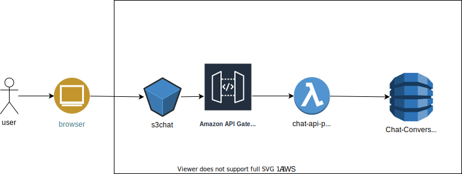

# Demo App to Learn AWS 

This is a simple demo application using different aws services.

The code is more or less following the course 'Build a Serverless App with AWS Lambda - Hands-On!' on O'Reilly Media. I replaced the js lambda code with python, because im currently learning some python :-)

## Current Overview

